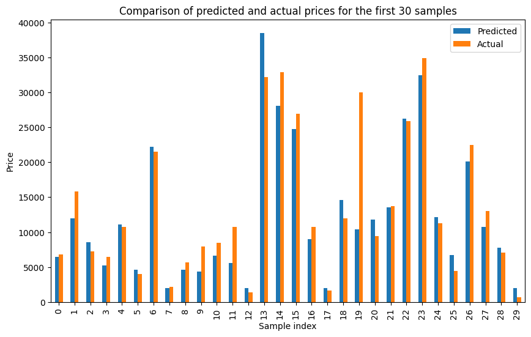

# Car Price Prediction Project
---
## Introduction

The aim of this project was to apply machine learning techniques to predict car prices based on various features.

---
## Dataset

The dataset used in this project consisted of several car attributes such as make, model, year, mileage, and others. Note that due to the nature of the collected data, there were several missing values which have been handled using mode imputation.

---
## Methodology

An iterative approach to building the model was used, where the model and its hyperparameters were continuously refined to increase performance. The model was evaluated based on the R^2 score, mean absolute error (MAE) and mean squared error (MSE).

---
## Results

The best model achieved an R^2 score between 80-82%, which indicates a fairly good fit to the data.

---
## Future Improvements

Potential future improvements could include experimenting with different techniques for handling missing data, trying different algorithms, applying regularization, adjusting hyperparameters, and searching for additional data.

---
## Conclusion

Despite some challenges related to data quality and bias, the model was successful in predicting car prices, explaining approximately 81.6% of the variance in the data. The iterative training process in this project emphasizes the importance of continuous learning and adjustment in machine learning projects.

---
## Running the Project

To run the project, you'll need Python along with several packages including Pandas, Numpy, Sklearn, and others. The main code for the project can be found in the Jupyter Notebook file in the jupyter-notebook directory: `car-price-prediction.ipynb`.

Clone the repository, install the necessary packages, and then you can run the notebook file in a Jupyter Notebook environment. Please make sure you have the required dataset available in your local directory for the notebook to access.

---
## Contributing

Contributions, issues, and feature requests are welcome. Please provide feedback to help me improve.
